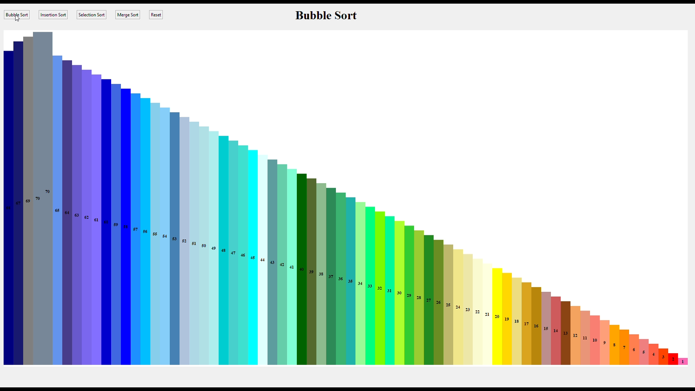

# SortVisualization
Visulaizing different sorting methods like Bubble Sort, Selection, Quick Sort, Merge Sort with Tkinter python module.

# Features
- visualize sorting algorithms
- rearrange blocks with reset button

## Demo

Link to demo

[https://drive.google.com/file/d/1iNf74NqU1ZWMKS7bjM_w0mOMbkT4JV9b/view?usp=sharing
](https://drive.google.com/file/d/1ic6aCzSUsHyiT0YmSzTMwJ2J0Ru26ZFl/view?usp=sharing)

## Screenshots

## Lessons Learned

Learned different sorting algorithms and how to represent dynamic elements in GUI.

## Authors

- [@DhruvDholakia](https://www.github.com/DhruvDholakiaCE)

